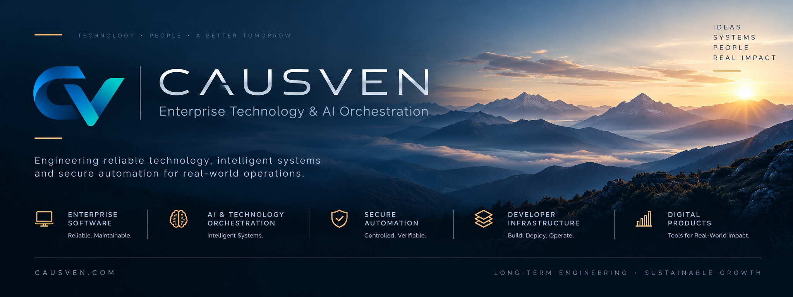

  

# CAUSVEN

### Enterprise Technology & AI Orchestration

**Engineering dependable software, intelligent systems, secure automation, and developer infrastructure for real-world operations.**

CAUSVEN is a technology engineering organization focused on building production-grade systems designed for reliability, security, maintainability, and long-term operation.

We develop software products, AI-enabled systems, automation infrastructure, and developer technologies with an emphasis on controlled execution, clear operational boundaries, and dependable engineering.

Our approach is simple: technology should not only be powerful — it should be understandable, maintainable, predictable, and built to last.

---

## Technology Areas

### Enterprise Software
Production-oriented software architecture and applications designed around reliability, maintainability, security, and operational clarity.

### AI & Technology Orchestration
Systems that coordinate AI, software components, automation, infrastructure, and human decision-making within controlled operational workflows.

### Secure Automation
Automation infrastructure designed around explicit authority, verification, controlled execution, traceability, and failure-safe behavior.

### Developer Infrastructure
Engineering tools and platforms supporting software development, verification, deployment, operations, and lifecycle management.

### Digital Products
Focused software products and technical solutions built for developers, organizations, and demanding production environments.

---

## Engineering Philosophy

We believe dependable technology is built through disciplined engineering rather than unnecessary complexity.

Our systems are developed around principles of:

**Security by Design** · **Reliability** · **Operational Control** · **Maintainability** · **Traceability** · **Production Readiness**

Where automation or AI is involved, human authority and clearly defined operational boundaries remain fundamental parts of the architecture.

---

## Built for the Long Term

CAUSVEN develops technology with lifecycle thinking from the beginning.

Architecture, deployment, maintenance, verification, documentation, and operational continuity are treated as parts of the product — not afterthoughts.

The objective is technology that organizations and developers can understand, operate, maintain, and rely on over time.

---

## Products & Engineering

Our public repositories, documentation, developer resources, and selected technology projects will be published here as they become available.

Commercial products and official information are available through our website.

---

### CAUSVEN

**Enterprise Technology & AI Orchestration**

🌐 **causven.com**  
✉️ **contact@causven.com**
